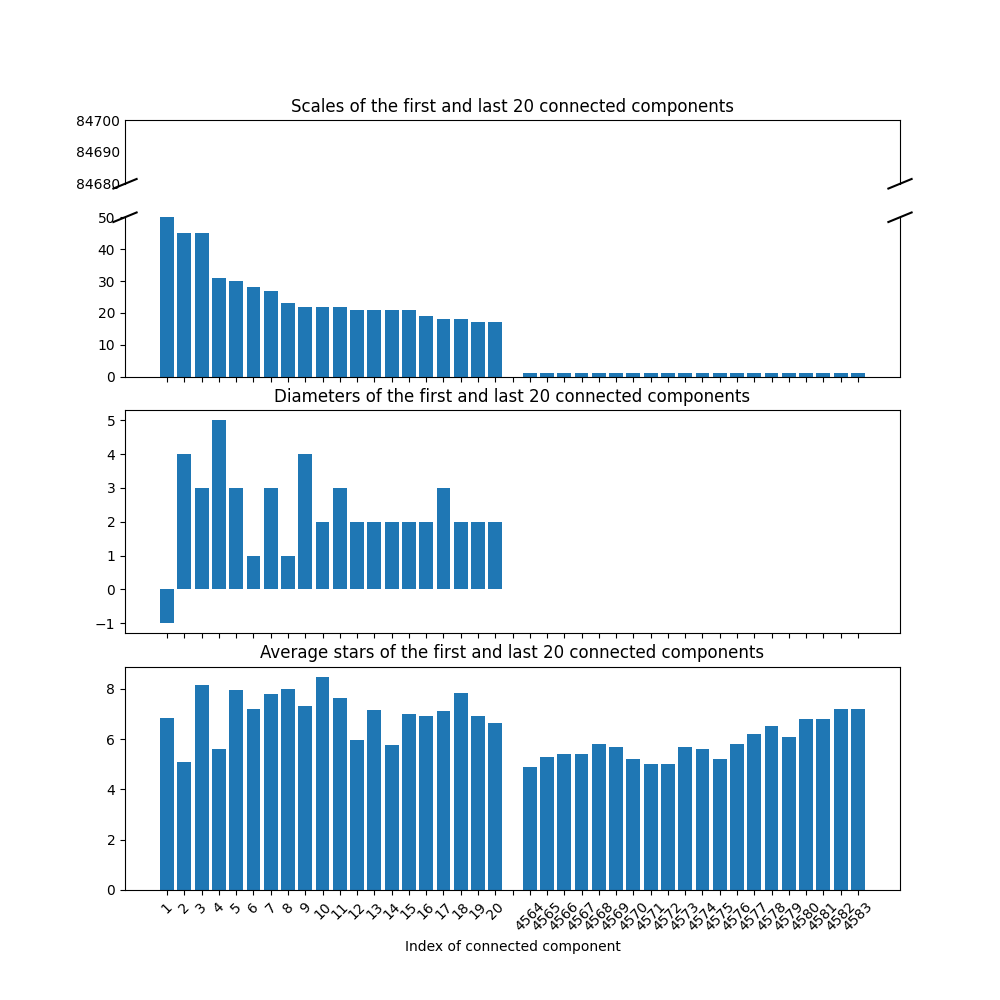

期末作业: 演员的小世界
===================
  
  
- [代码说明](#代码说明 )
- [运行结果](#运行结果 )
  - [连通分支](#连通分支 )
  - [画图](#画图 )
  - [周星驰](#周星驰 )
  
##  代码说明
  
  
##  运行结果
  
  
  
###  连通分支
  
共4577个连通分支
|序号|演员个数|电影类别|直径|
|---|-----|----|---|
|1|84687|剧情, 喜剧, 爱情|-1|
|2|45|恐怖, 历史, 战争|4|
|3|45|纪录片, 历史, 战争|3|
|4|31|剧情, 犯罪, 同性|5|
|5|30|剧情, 爱情|3|
|6|28|剧情, 动作, 历史|1|
|7|27|剧情, 喜剧, 恐怖|3|
|8|23|剧情, 音乐|1|
|9|22|剧情, 爱情, 喜剧|4|
|10|22|剧情, 喜剧, 儿童|2|
|11|22|剧情, 悬疑|3|
|12|21|动作, 剧情, 传记|2|
|13|21|剧情, 喜剧|2|
|14|21|情色, 剧情, 爱情|2|
|15|21|剧情, 惊悚, 历史|2|
|16|19|剧情, 同性, 爱情|2|
|17|18|剧情, 同性, 喜剧|3|
|18|18|剧情|2|
|19|17|剧情, 动作, 惊悚|2|
|20|17|剧情, 科幻, 悬疑|2|
|...|...|...|...|
|4558|1|恐怖|0|
|4559|1|恐怖|0|
|4560|1|恐怖|0|
|4561|1|恐怖|0|
|4562|1|惊悚, 恐怖|0|
|4563|1|恐怖|0|
|4564|1|恐怖|0|
|4565|1|恐怖|0|
|4566|1|恐怖|0|
|4567|1|恐怖|0|
|4568|1|恐怖, 纪录片|0|
|4569|1|喜剧, 恐怖, 短片|0|
|4570|1|剧情, 恐怖|0|
|4571|1|剧情, 恐怖|0|
|4572|1|恐怖|0|
|4573|1|恐怖|0|
|4574|1|恐怖, 短片|0|
|4575|1|恐怖, 纪录片|0|
|4576|1|恐怖, 短片|0|
|4577|1|恐怖|0|
###  画图
  

###  周星驰
  
周星驰出演电影的平均星级为7.19
周星驰和他的的共同出演者一共302人
周星驰和他的共同出演者共演出了3132部电影, 所出演电影的平均星级为6.26, 电影所属类别前三名为动作, 剧情, 喜剧
  
  